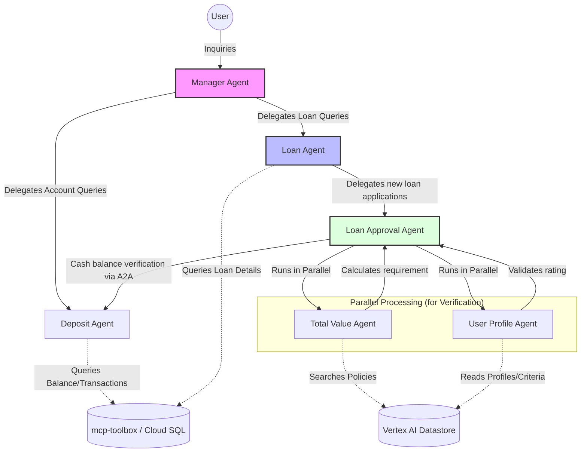

# Agent Architecture Diagram

```mermaid
graph TD
    %% Primary User Entry Point
    User((User))

    %% Root Agents
    ManagerAgent[Manager Agent]
    LoanAgent[Loan Agent]
    
    %% Sub-Agents (Delegated)
    DepositAgent[Deposit Agent]
    LoanApprovalAgent[Loan Approval Agent]
    
    %% Nested Sub-Agents (Inside Loan Approval)
    TotalValueAgent[Total Value Agent]
    UserProfileAgent[User Profile Agent]
    
    %% Parallel Execution Group
    subgraph "Parallel Processing (for Verification)"
        direction LR
        TotalValueAgent[Total Value Agent]
        UserProfileAgent[User Profile Agent]
    end

    %% Infrastructure/Tools
    Toolbox[(mcp-toolbox / Cloud SQL)]
    Datastore[(Vertex AI Datastore)]

    %% Relationships - Delegation
    User -->|Inquiries| ManagerAgent
    ManagerAgent -->|Delegates Account Queries| DepositAgent
    ManagerAgent -->|Delegates Loan Queries| LoanAgent
    
    LoanAgent -->|Delegates new loan applications| LoanApprovalAgent
    
    LoanApprovalAgent -->|Runs in Parallel| TotalValueAgent
    LoanApprovalAgent -->|Runs in Parallel| UserProfileAgent
    
    %% Tool Usage
    DepositAgent -.->|Queries Balance/Transactions| Toolbox
    LoanAgent -.->|Queries Loan Details| Toolbox
    TotalValueAgent -.->|Searches Policies| Datastore
    UserProfileAgent -.->|Reads Profiles/Criteria| Datastore
    
    %% Specific Logic Links
    TotalValueAgent -->|Calculates requirement| LoanApprovalAgent
    UserProfileAgent -->|Validates rating| LoanApprovalAgent
    LoanApprovalAgent -->|Cash balance verification via A2A| DepositAgent

    style ManagerAgent fill:#f9f,stroke:#333,stroke-width:2px
    style LoanAgent fill:#bbf,stroke:#333,stroke-width:2px
    style LoanApprovalAgent fill:#dfd,stroke:#333,stroke-width:2px
```
