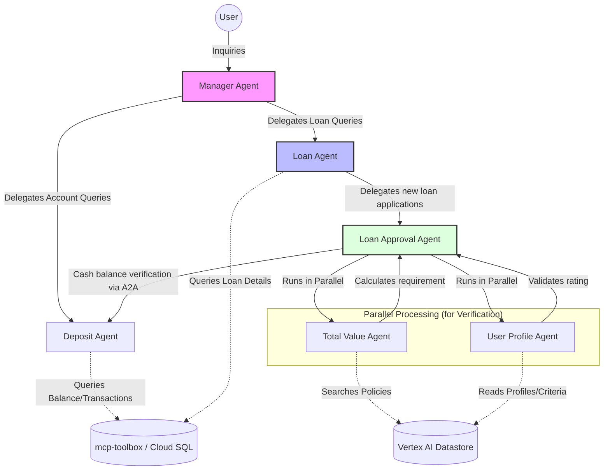

# Agent Architecture Diagram

## Agent Information

### 1. Manager Agent (`solution/manager/agent.py`)
The central orchestrator for the bank. It routes general inquiries to:
* **Deposit Agent**: For balances and transactions
* **Loan Agent** For all things related to loans

### 2. Loan Agent (`solution/loan/agent.py`)
Specialized in loan management.
* For existing loans, it retrieves details directly via SQL tools.
* For new loan requests, it delegates the complex evaluation process to the **Loan Approval Agent**.

### 3. Loan Approval Agent (`solution/loan/loan.py`)
A highly complex orchestrator that manages a multi-step verification pipeline:
- **Parallel Step** executes simultaneously:
  - `Total Value Agent` to compute required cash balance threshold
  - `User Profile Agent` to determine customer rating.
- **Verification Step**: Triggers the `Deposit Agent` (`Check Equity Agent`) via A2A to confirm if the user's current cash balance meets the calculated requirement.
- **Reporting Step**: Uses the `Approval Report Agent` to generate a final, customer-friendly decision message.

### 4. Specialized Sub-Agents
- **Deposit Agent**: Handles account balance and transaction history queries using SQL tools.
- **User Profile Agent**: Extracts customer ratings by cross-referencing loan officer summaries with official bank criteria in the Datastore.
- **Total Value Agent**: Orchestrates policy searches and calculation of necessary deposit buffers based on debt-to-equity ratios.
